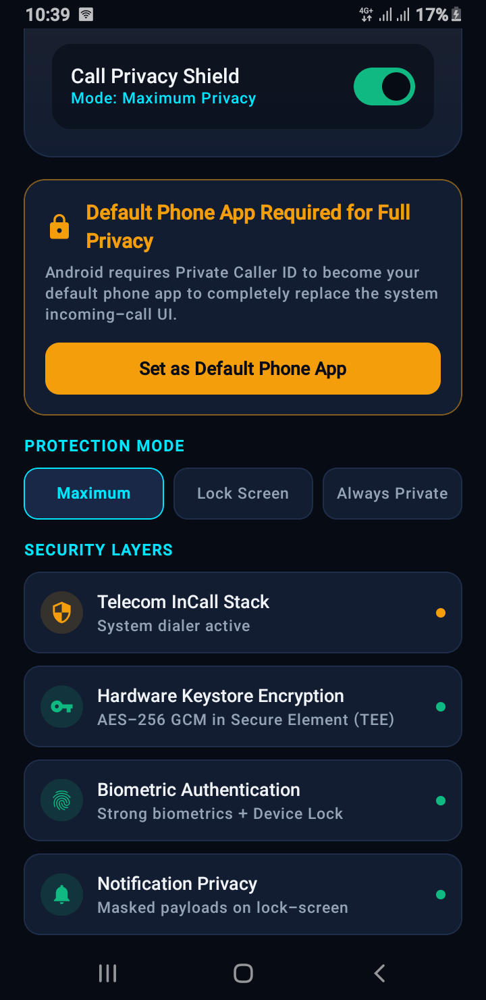

# 🛡️ Caller Privacy Lock

[-3DDC84?style=flat&logo=android&logoColor=white)](https://developer.android.com)
[](https://kotlinlang.org)
[](https://developer.android.com/jetpack/compose)

**Caller Privacy Lock** is a security and privacy-first Android dialer and call management application designed to protect sensitive incoming caller identities from prying eyes, lock-screen eavesdropping, and shoulder surfing.

When a call is received, caller details (name, number, photo) remain securely masked behind a privacy shield until the authorized user authenticates using the device's **built-in screen lock security** Fingerprint, Face Unlock, or PIN/Pattern/Password, whichever is already configured on the phone.

> 🤖 **Built with AI assistance**: this project was developed with the help of AI tools to accelerate architecture design, code generation, and testing.

---

## 🎬 App Demo

<p align="center">
  <a href="https://youtube.com/shorts/F2UdUfgmiaw">
    
  </a>
</p>
*Click the screenshot above to watch the app in action on YouTube.*

---

## ✨ Key Features

### 🔒 Identity Masking & Authenticated Reveal
- **Lock-Screen Privacy Shield**: Obfuscates or completely conceals caller information on incoming calls.
- **Device Security Reveal**: Instant one-touch caller reveal using the phone's own built-in `BiometricPrompt` system (Fingerprint / Face ID) no separate biometric setup needed.
- **Fallback Device PIN/Pattern**: Falls back to the phone's existing screen lock PIN, pattern, or password when biometrics aren't set up or available.
- **Privacy Auto-Hide**: Automatically re-masks caller identity after an adjustable timeout or when the device is laid face-down.

### 📞 Native Telecom & In-Call Management
- **Telecom InCallService Integration**: Deep integration with Android's native Telecom subsystem for low-latency call handling.
- **Call Screening**: Built-in `CallScreeningService` to intercept, inspect, and route incoming calls.
- **Real-Time Audio Hardware Control**:
  - **Speakerphone**: Seamless routing between Built-in Earpiece, Built-in Speaker, and Bluetooth devices (Android 12+ Communication Device API & legacy fallback).
  - **Microphone Mute**: Direct microphone hardware state control.
  - **Instant Silence**: Silence ringer immediately without dropping or declining the call.
- **Responsive Call Controls**: Ergonomically placed Reject/Cancel and Accept controls with tactile feedback and zero layout shift.

### 🎨 Modern Material 3 Cyber Interface
- **Modern Jetpack Compose UI**: Built entirely with declarative Jetpack Compose and Material Design 3.
- **Obsidian & CyberCyan Aesthetic**: Deep dark theme optimized for OLED power efficiency and low-light environments.
- **Unified Splash Engine**: Instant, flicker-free app startup powered by `androidx.core:core-splashscreen` compatible across Android 7.0 (API 24) through Android 17+.
- **Edge-to-Edge Experience**: Fluid layout handling status bar and navigation bar insets cleanly.

### ⚡ Performance & Security
- **100% Local & Offline**: All biometric verifications, PIN hashes, and caller logs are stored exclusively on-device. No telemetry, no external analytics, and no remote server dependencies.
- **Zero-Latency State Synchronization**: Built on Kotlin Coroutines and reactive `StateFlow` streams.

---

## 🏗️ Architecture & Tech Stack

The project follows modern Android architectural guidelines, utilizing clean boundaries, unidirectional data flow (UDF), and separation of concerns.

```
├── app/
│   ├── src/main/java/com/example/
│   │   ├── data/                 # Repositories, DataStore, and Model Definitions
│   │   │   ├── model/            # CallData, CallerRevealState, CallAudioRoute
│   │   │   └── repository/       # SettingsRepository & Security Preferences
│   │   ├── presentation/         # Jetpack Compose UI & State Holders
│   │   │   ├── call/             # IncomingCallScreen, IncomingCallViewModel, IncomingCallActivity
│   │   │   ├── components/       # Action Buttons, Pin Pad, Identity Card
│   │   │   ├── dashboard/        # Dashboard, Protection Toggle, Simulation Hub
│   │   │   ├── navigation/       # Type-Safe Navigation Compose Graph
│   │   │   ├── settings/         # Privacy Customization & Biometric Config
│   │   │   └── theme/            # Color Schemes, Typography, Shapes
│   │   ├── telecom/              # Android Telecom & Audio Integration
│   │   │   ├── CallManager.kt    # Central Call State & Audio Routing Engine
│   │   │   ├── InCallServiceImpl # Telecom InCallService Implementation
│   │   │   └── CallScreening     # Call Screening Interceptor
│   │   └── util/                 # BiometricHelper, PrivacyLogger, VibrationEngine
```

### Libraries & Frameworks
| Layer | Technologies |
|---|---|
| **Language** | Kotlin 2.0+ |
| **UI Framework** | Jetpack Compose (Material 3) |
| **Lifecycle & State** | Jetpack Lifecycle Compose, ViewModel, StateFlow, Coroutines |
| **System Integration** | Android Telecom API, InCallService, CallScreeningService, AudioManager |
| **Security** | AndroidX Biometric, Android Keystore, Encrypted SharedPreferences / DataStore |
| **Splash & Navigation** | `androidx.core:core-splashscreen`, Navigation Compose |
| **Testing** | Robolectric, Roborazzi, JUnit4 |

---

## 🚀 Getting Started

### Prerequisites
- **Android Studio**: Ladybug (2024.2.1) or newer
- **Android SDK**: Min SDK 24 (Android 7.0), Target SDK 35 (Android 15+)
- **JDK**: Java 17 or Java 21

### Installation & Build

1. **Clone the repository:**
   ```bash
   git clone https://github.com/alsaeeddev/android-caller-privacy-lock.git
   cd android-caller-privacy-lock
   ```

2. **Open in Android Studio:**
   - Open Android Studio, select **Open**, and browse to the cloned directory.

3. **Build the Debug APK via Gradle:**
   ```bash
   gradle :app:assembleDebug
   ```

4. **Run Unit & Architecture Tests:**
   ```bash
   gradle :app:testDebugUnitTest
   ```

---

## 📱 Permissions Used

| Permission | Purpose |
|---|---|
| `android.permission.READ_CALL_LOG` | To identify caller details and cross-reference contact masking rules. |
| `android.permission.READ_PHONE_STATE` | To detect incoming call states and trigger privacy protection UI. |
| `android.permission.ANSWER_PHONE_CALLS` | To allow secure answering directly from the privacy interface. |
| `android.permission.CALL_PHONE` | Direct dialing and returning protected calls. |
| `android.permission.USE_BIOMETRIC` | Biometric fingerprint and face authentication. |
| `android.permission.POST_NOTIFICATIONS` | To present secure, privacy-sanitized ongoing call notifications. |
| `android.permission.MODIFY_AUDIO_SETTINGS` | To toggle speakerphone, mute microphone, and silence ringtone. |

---

## 🔒 Privacy Commitment

- **Zero Cloud Tracking**: Caller Privacy Lock operates completely offline.
- **No Third-Party SDKs**: No trackers, ads, or third-party analytical SDKs are bundled.
- **Biometrics Protection**: Biometric operations rely on hardware-backed Android `BiometricPrompt` security guarantees.

---

## 💼 Hire the Developer

Need a custom Android app, or Kotlin & Jetpack Compose development for your own project? I build production-ready Android apps end-to-end architecture, UI, and Play Store deployment.

📩 **Contact for client work / custom builds**: [@alsaeeddev](https://instagram.com/alsaeeddev) on Instagram

---
